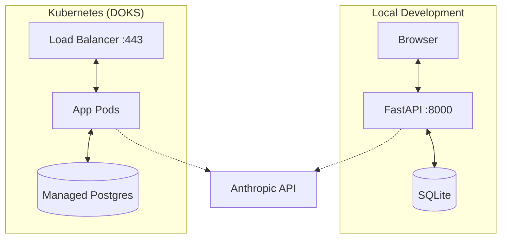

# Dungeon Minus One

A conversational text-adventure game powered by Claude.

## System Architecture



## Quick Start (Local)

1.  **Setup**: Create venv and install dependencies.
    ```bash
    make setup
    cp .env.example .env  # Add your ANTHROPIC_API_KEY
    ```
    Set `ENVIRONMENT=dev` and leave `DB_AUTO_CREATE=true` for local use.

2.  **Run**: Start the dev server.
    ```bash
    make run
    ```
    Access at `http://localhost:8000`.

## Kubernetes Deployment

The application is deployed to DigitalOcean Kubernetes (DOKS) with a managed PostgreSQL database.

```bash
# Build and push Docker image
make docker-release TAG=v0.6.0

# Deploy to cluster
make k8s-deploy TAG=v0.6.0

# Check status
make k8s-status
```

-   **TLS**: DO Load Balancer with managed certificate
-   **Database**: Managed PostgreSQL
-   **Secrets**: Doppler Kubernetes Operator
-   **Auth**: Invite-only (`make k8s-invite`)

## One-Command Releases

If your `infra/.env.deploy` includes Spaces credentials, you can deploy in one step:

```bash
# Staging (assets-staging.dungeonminusone.com)
make release-staging TAG=v0.7.0

# Production (assets.dungeonminusone.com)
make release-prod TAG=v0.7.0
```

These targets will build/upload assets to Spaces, push the Docker image,
and deploy the updated image tag to Kubernetes.

## Frontend Assets (Spaces + CDN)

Frontend assets are published to DigitalOcean Spaces (NYC3) and served via CDN to avoid
asset hash mismatches during rolling deploys. The app still serves HTML with
`Cache-Control: no-store`.

Setup (one-time):

1. Create a Space named `dungeon-minus-one-assets` in `nyc3` and enable the CDN.
2. Add custom CDN domains (recommended):
   - Staging: `assets-staging.dungeonminusone.com`
   - Production: `assets.dungeonminusone.com`
3. Configure Spaces CORS to allow GET/HEAD from your app domains.
4. Create a Spaces access key and export:
   - `SPACES_ACCESS_KEY`
   - `SPACES_SECRET_KEY`

Deploy example (staging):

```bash
ASSET_ENV=staging \
ASSET_CDN_DOMAIN=assets-staging.dungeonminusone.com \
make docker-release TAG=v0.6.2

make k8s-deploy TAG=v0.6.2
```

`make docker-release` will call `make assets-publish` automatically when
`ASSET_BASE_URL` is set (derived from `ASSET_CDN_DOMAIN`, `ASSET_ENV`, and `TAG`).

## Commands

Run `make help` to see all available commands.

| Command | Description |
| :--- | :--- |
| `make run` | Run local dev server |
| `make reset` | Clear game state (keep locations) |
| `make hard-reset` | Wipe DB and re-seed locations |
| `make verify-movement` | Run automated test for movement logic |
| `make validate-config` | Validate configuration (set `DB_CHECK=true` to test DB) |
| `make invite` | Generate invite code (local) |
| `make k8s-deploy` | Deploy app to DOKS cluster |
| `make k8s-status` | Show pods, services, secrets |
| `make k8s-logs` | Stream pod logs |
| `make k8s-invite` | Generate invite code in cluster |

## Debug Logging

The API output includes debug prints only when explicitly enabled. Leave these unset/false for clean responses.

- `DEBUG_LLM=true` enables LLM context debug prints and writes JSON lines to `.cursor/llm_debug.log`.
- `DEBUG_GAME_TOOLS=true` enables tool handler debug prints and writes JSON lines to `.cursor/debug.log`.
- `DEBUG_SERVICE=true` enables service debug JSON logging to `.cursor/service_debug.log` (no console output).

To silence Uvicorn access logs, run with `--log-level warning` (for example, update `make run`).
