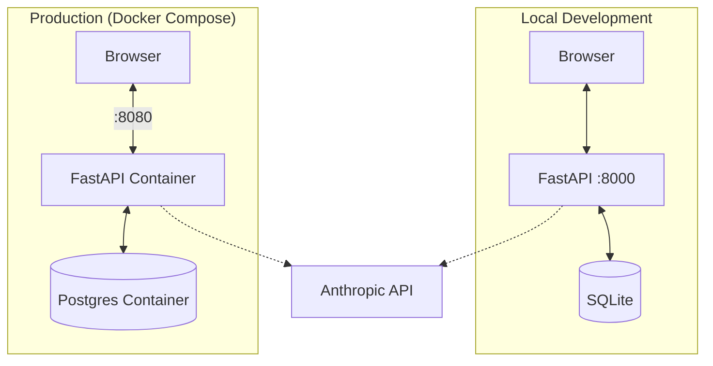

# Dungeon Minus One

A conversational text-adventure game powered by Claude.

## System Architecture



## Quick Start (Local)

1.  **Setup**: Create venv and install dependencies.
    ```bash
    make setup
    cp .env.example .env  # Add your ANTHROPIC_API_KEY
    ```

2.  **Run**: Start the dev server.
    ```bash
    make run
    ```
    Access at `http://localhost:8000`.

## Production

Deploy on a single VM using Docker Compose.

```bash
# Start production services detached
docker compose -f docker-compose.prod.yml up -d --build
```

-   **Port**: 8080
-   **Database**: PostgreSQL (persisted in volume)
-   **Auth**: Invite-only (see `make prod-invite`)

## Commands

Run `make help` to see all available commands.

| Command | Description |
| :--- | :--- |
| `make run` | Run local dev server |
| `make reset` | Clear game state (keep locations) |
| `make hard-reset` | Wipe DB and re-seed locations |
| `make invite` | Generate invite code (local) |
| `make prod-up` | Start production containers |
| `make prod-logs` | Tail production logs |
