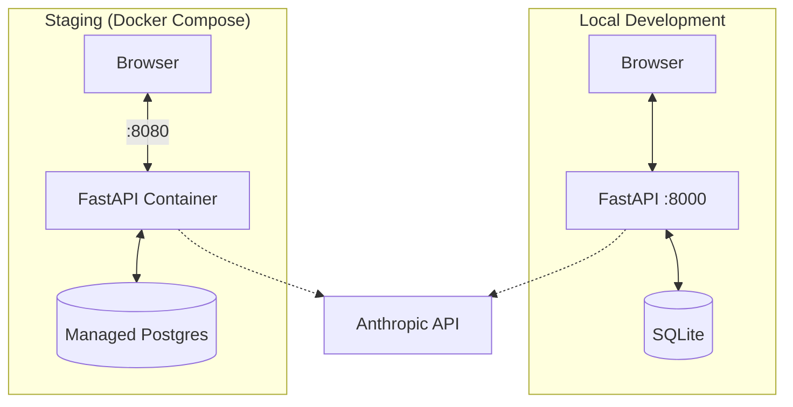

# Dungeon Minus One

A conversational text-adventure game powered by Claude.

## System Architecture



## Quick Start (Local)

1.  **Setup**: Create venv and install dependencies.
    ```bash
    make setup
    cp .env.example .env  # Add your ANTHROPIC_API_KEY
    ```
    Set `ENVIRONMENT=dev` and leave `DB_AUTO_CREATE=true` for local use.

2.  **Run**: Start the dev server.
    ```bash
    make run
    ```
    Access at `http://localhost:8000`.

## Staging

Deploy on staging using Docker Compose.

```bash
# Start staging services detached
docker compose -f docker-compose.staging.yml up -d
```

-   **Port**: 8080
-   **Database**: Managed PostgreSQL (external)
-   **Auth**: Invite-only (preferred: `make invite-staging`, uses Doppler project `staging-deployment`)
    -   Set `ENVIRONMENT=staging`, `DB_AUTO_CREATE=false`, `APP_IMAGE=...`, and a strong `AUTH_SECRET_KEY`.
    -   For invite API guardrails, set `INVITE_IP_ALLOWLIST`, `TRUST_PROXY_HEADERS=true`, and `TRUSTED_PROXY_IPS` (LB IPs/CIDRs).

## Commands

Run `make help` to see all available commands.

| Command | Description |
| :--- | :--- |
| `make run` | Run local dev server |
| `make reset` | Clear game state (keep locations) |
| `make hard-reset` | Wipe DB and re-seed locations |
| `make verify-movement` | Run automated test for movement logic |
| `make validate-config` | Validate configuration (set `DB_CHECK=true` to test DB) |
| `make invite` | Generate invite code (local) |
| `make invite-staging` | Generate invite via API using Doppler (staging only) |
| `make invite-api` | Alias for `make invite-staging` |
| `make staging-up` | Start staging containers |
| `make staging-logs` | Tail staging logs |

## Debug Logging

The API output includes debug prints only when explicitly enabled. Leave these unset/false for clean responses.

- `DEBUG_LLM=true` enables LLM context debug prints and writes JSON lines to `.cursor/llm_debug.log`.
- `DEBUG_GAME_TOOLS=true` enables tool handler debug prints and writes JSON lines to `.cursor/debug.log`.
- `DEBUG_SERVICE=true` enables service debug JSON logging to `.cursor/service_debug.log` (no console output).

To silence Uvicorn access logs, run with `--log-level warning` (for example, update `make run`).
